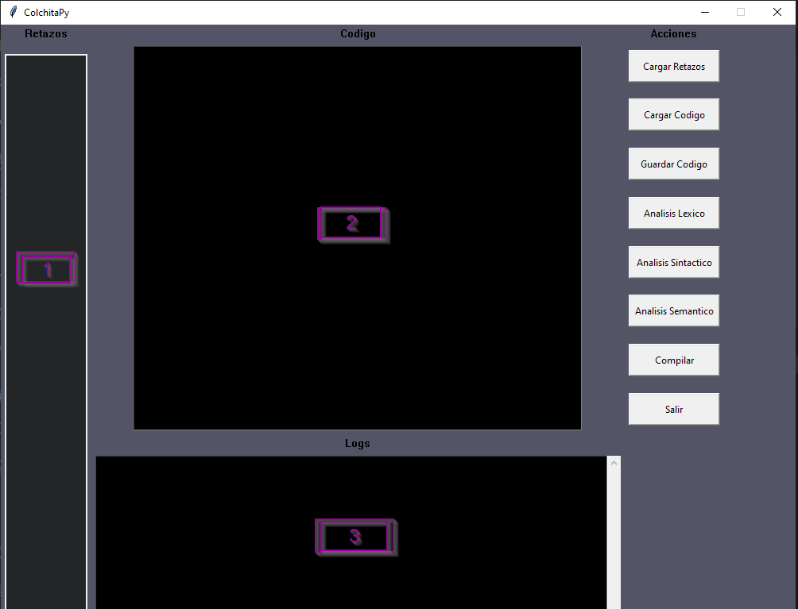
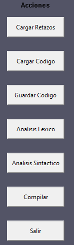

# colchita
## Parse y generación de código
## Profesor: Pablo pandolfo
## Estudiantes: Martín Acuña, Emiliano Churruca y Hernán Guzmán.
Para la realización del trabajo utilizamos como guía un recurso de internet, dejamos a continuación el enlace a los mismos.

## Video explicativo lexico y sintactico
https://youtu.be/ESerD10Au24?si=BG8wamtesk-28uU2

## Video explicativo semantico
https://www.youtube.com/watch?v=s0Anb8T6mU8&t=88s

## Lenguaje colchita en formato BNF
 ```
 <exp ::= <name> | <name> (<actuals>) | turn (<exp>) | sew (<exp>,<exp>) | let <decls> in <exp> end 
 <actuals> ::= <exp> | <exp> , <actuals>
 <decls> ::= <decl> | <decl> <decls>
 <decl> ::= fun <name> (<formals>) = <exp> | val <name> = <exp>
 <formals> ::= <name> | <name> , <formals>
 <name> ::= chars | <name> chars
```
El presente trabajo requiere intalar la librerías PLY (una herramienta de análisis sintáctico en Python) y para el tratamiento de imágenes utilizamos opencv y pillow.

## Instalación:
Para instalar las librerías,  asegurese de tener la última actualización de "pip" (gestor de paquetes) y utilice en una consola el comando.
```
pip install ply
```
```
pip install opencv-python
```
```
pip install pillow
```
Una vez que están todas las librerías instaladas se debe ejecutar el archivo main, al hacerlo, se habre la interfaz gráfica del trabajo.

La ventana principal tiene 4 partes 



1. La parte donde se cargan los retazos.
1. La parte para escribir y/o cargar el programa fuente
1. La parte de consola de salida
1. La parte 4 son los botones, las acciones a realizar



Para qué se utiliza cada uno de los botones:

## Cargar Retazos

Desde aquí se puede explorar el dispositivo para cargar los retazos en el panel izquierdo.

## Cargar Codigo

Desde aquí se puede cargar un programa fuente. Una  vez cargado, se puede editar

## Guardar Codigo

Desde aquí se puede guardar un programa fuente.

## Analisis lexico

Este apartado es para realizar detalladamente el análisis léxico, en la consola se muestra cada uno de los tokens que va reconociendo, en caso de haber algún error léxico, se mostrará el mismo

## Analisis Sintactico

Este apartado es para realizar detalladamente el análisis sintáctico, en caso de haber algún error sintáctico, se mostrará el mismo

## Compilar

Ejecutando este botón se realiza el la compilación del programa cargado, si es correcto el análisis lexicográfico, sintáctico y semántico. De ser correcto, se muestra la **colchita** resultante.

## Salir

Para cerrar el programa.
